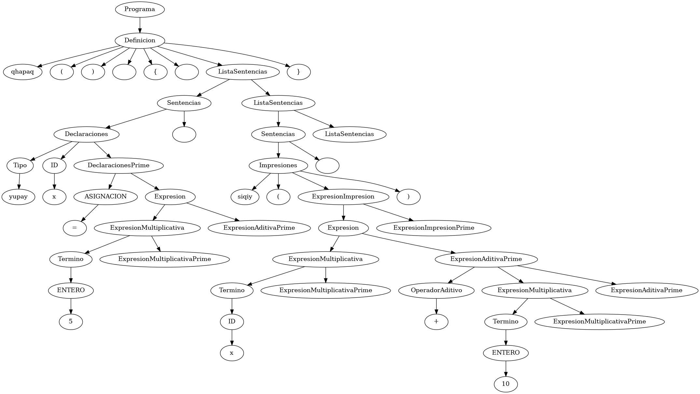

# Compilador Antachawy

Este proyecto tiene como objetivo desarrollar un compilador para un nuevo lenguaje de programación denominado Antachawy, el cual utiliza el quechua como base para sus sintaxis y términos. Este esfuerzo busca reducir la brecha digital que existe actualmente en Perú, promoviendo el uso de tecnologías y lenguajes de programación accesibles para las comunidades quechuahablantes.
Este lenguaje utiliza el Quechua Collao como base.

## Requisitos Previos

- Python 3.8 o superior
- pip (gestor de paquetes de Python)
- git
- gcc (para la compilacion del codigo C generado)

## Creación y Activación de un Entorno Virtual

Primero se debe clonar el repositorio.

```bash
git clone https://github.com/GiomarMC/Antachawy.git
```

Luego ubicarse en la carpeta donde se encuentra el proyecto y continuar con la creacion del entorno virtual.

### En Windows

1. Abre una terminal (cmd, PowerShell, o Git Bash).
2. Navega al directorio del proyecto.
3. Crea un entorno virtual con el siguiente comando:

    ```bash
    python -m venv .venv
    ```

4. Activa el entorno virtual:

    ```bash
    .\.venv\Scripts\activate
    ```

### En Linux/MacOS

1. Abre una terminal.
2. Navega al directorio del proyecto.
3. Crea un entorno virtual con el siguiente comando:

    ```bash
    python3 -m venv .venv
    ```

4. Activa el entorno virtual:

    ```bash
    . .venv/bin/activate
    ```

## Instalación de Compilador y sus requerimientos

Una vez que el entorno virtual esté activado, instala el paquete de Python, ejecuta el siguiente comando.

1. Asegúrate de estar en el directorio del proyecto y que el entorno virtual esté activado.
2. Ejecuta el siguiente comando:

### En Linux/MacOS

```bash
python3 setup.py install
```

## En Windows

```bash
python setup.py install
```

Esto instalará todas las dependencias necesarias para el proyecto.

## Ejecución del Compilador

Con el entorno virtual activado y el paquete de python instalado, puedes ejecutar el compilador con el siguiente comando:

```bash
antachawy archivo.awy
```

Reemplaza el archivo.awy con el nombre del archivo fuente que deseas compilar.    
Por defecto el compilador generara un archivo ejecutable llamado `run` o `run.exe` si utilizas un Sistema Operativo Linux o Windows respectivamente.
Para ejecutar el ejecutable deberas hacerlo de la siguiente manera.

### En Windows

```bash
.\run.exe
```

### En Linux

```bash
./run
```

## Opciones adicionales

El compilador de Antachawy cuenta con un CLI, los comandos que utiliza se utilizando el siguiente comando.

```bash
antachawy -h
```

Apareceran las siguientes opciones.

```bash
-o, --output: Especifica el nombre del archivo de salida (ejecutable generado).
-d, --debug: Genera archivos de depuración en la carpeta outputs.
-v, --version: Muestra la versión del compilador.
```

## Sobre el Lenguaje

### Operaciones Basicas

El lenguaje Antachawy soporta las siguientes operaciones basicas:

- Suma: + (ejemplo: c = a + b).
- Resta: - (ejemplo: c = a - b).
- Multiplicación: * (ejemplo: c = a * b).
- División: / (ejemplo: c = a / b).

### Palabras Reservadas

A continuacion se presenta una lista de las palabras reservadas en el lenguaje Antachawy y su funcionalidad.

| Palabra Reservada | Funcionalidad                          |
|-------------------|----------------------------------------|
| `qhapaq`          | Define el inicio de un programa        |
| `siqiy`           | Función para imprimir                  |
| `bool`            | Tipo de dato booleano                  |
| `yanqa`           | Booleano falso                         |
| `chiqaq`          | Booleano verdadero                     |
| `yupay`           | Tipo de dato entero                    |
| `chunkayuq`       | Tipo de dato flotante                  |
| `sananpa`         | Tipo de dato carácter                  |
| `qaytu`           | Tipo de dato cadena                    |

### Ejemplo

A continuacion se mostrara un ejemplo de codigo fuente utilizando el lenguaje Antachawy.

```bash
qhapaq () 
{
    yupay a = 1
    yupay b = 2
    yupay c
    c = a * b
    sananpa letra = 'A'
    siqiy ("La multiplacion de ", a, " * ", b, " es ", c)
    siqiy ("La letra es", letra)
}
```

Suponiendo que el archivo se llama main.awy, un ejemplo de compilacion seria el siguiente.

```bash
antachawy main.awy -o main
```

Se generara un archivo ejecutable el cual podras ejecutar siguiendo los pasos anteriores.

Si se realiza un debug mostrara algunos archivos con contenidos como el AST generado por el compilador en una carpeta llamada outputs:
A continuacion un ejemplo

```bash
antachawu main.awy -o main -d
Programa
└── Definicion
    ├── qhapaq
    ├── (
    ├── )
    ├── \n
    ├── {
    ├── \n
    ├── ListaSentencias
    │   ├── Sentencias
    │   │   ├── Declaraciones
    │   │   │   ├── Tipo
    │   │   │   │   └── yupay
    │   │   │   ├── ID
    │   │   │   │   └── x
    │   │   │   └── DeclaracionesPrime
    │   │   │       ├── ASIGNACION
    │   │   │       │   └── =
    │   │   │       └── Expresion
    │   │   │           ├── ExpresionMultiplicativa
    │   │   │           │   ├── Termino
    │   │   │           │   │   └── ENTERO
    │   │   │           │   │       └── 5
    │   │   │           │   └── ExpresionMultiplicativaPrime
    │   │   │           └── ExpresionAditivaPrime
    │   │   └── \n
    │   └── ListaSentencias
    │       ├── Sentencias
    │       │   ├── Impresiones
    │       │   │   ├── siqiy
    │       │   │   ├── (
    │       │   │   ├── ExpresionImpresion
    │       │   │   │   ├── Expresion
    │       │   │   │   │   ├── ExpresionMultiplicativa
    │       │   │   │   │   │   ├── Termino
    │       │   │   │   │   │   │   └── ID
    │       │   │   │   │   │   │       └── x
    │       │   │   │   │   │   └── ExpresionMultiplicativaPrime
    │       │   │   │   │   └── ExpresionAditivaPrime
    │       │   │   │   │       ├── OperadorAditivo
    │       │   │   │   │       │   └── +
    │       │   │   │   │       ├── ExpresionMultiplicativa
    │       │   │   │   │       │   ├── Termino
    │       │   │   │   │       │   │   └── ENTERO
    │       │   │   │   │       │   │       └── 10
    │       │   │   │   │       │   └── ExpresionMultiplicativaPrime
    │       │   │   │   │       └── ExpresionAditivaPrime
    │       │   │   │   └── ExpresionImpresionPrime
    │       │   │   └── )
    │       │   └── \n
    │       └── ListaSentencias
    └── }
```

Tambien se podra apreciar la imagen del AST



## Contribuciones

¡Las contribuciones son bienvenidas! Siéntete libre de abrir issues o pull requests para mejorar el proyecto.